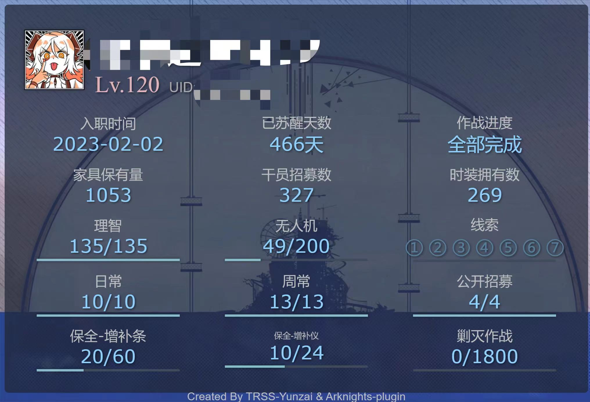
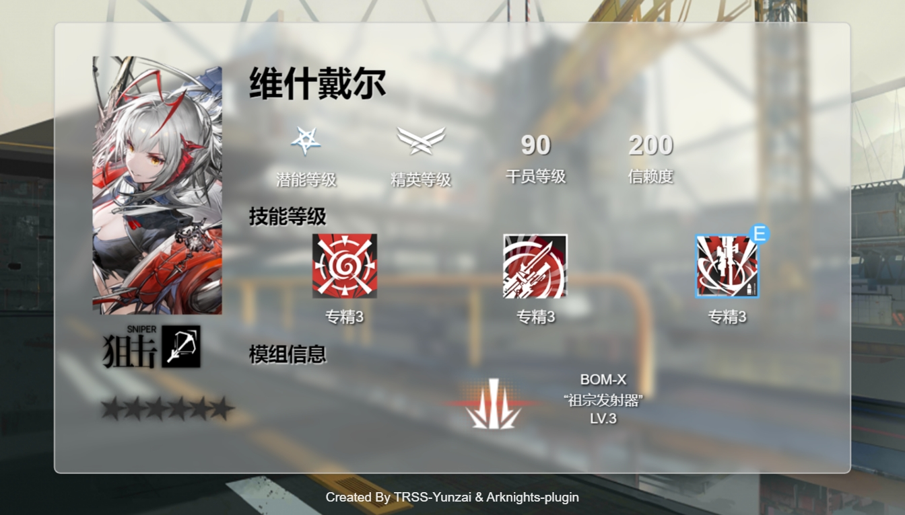
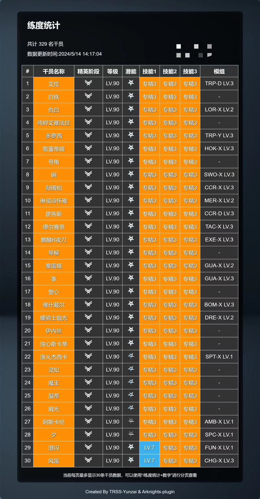
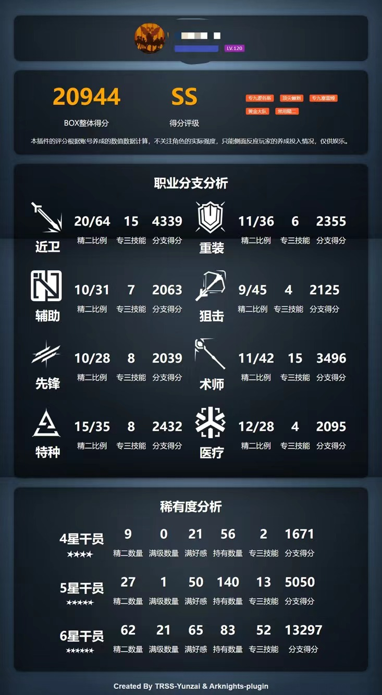

# 明日方舟

## 插件基本命令

- `#方舟帮助`  打开帮助菜单
  
## 森空岛cred管理

- `#方舟绑定` 绑定森空岛cred
- `#方舟删除cred` 删除已绑定的森空岛cred
- `#方舟我的cred` 查询已绑定的森空岛cred
- `#方舟我的token` 查询已绑定的token
- `#方舟cred帮助` 查询森空岛cred获取帮助文档

## 基本信息查询

- `#方舟便签` 森空岛个人信息一图流

- `#方舟理智` 通过森空岛接口查询理智
- `#方舟剿灭` 通过森空岛接口查询剿灭周常
- `#方舟日常` `#方舟周常` 通过森空岛接口查询周常完成
- `#方舟签到` 森空岛签到
- `#方舟叔叔`、`#方舟玛恩纳` 查看干员练度卡片

- `#方舟公招查询 支援 远程位` 公招查询，同时在结果中标记干员持有情况
- `#方舟练度统计` `#方舟近卫练度统计` 基于森空岛API查询干员练度汇总

- `#方舟练度分析` `#方舟BOX分析` 分析BOX练度数据，仅供娱乐

- `#方舟刷图推荐` `#方舟材料掉率` 从一图流获取材料掉率表
- `#方舟公告` `#方舟公告列表` 查询官方发布的公告
- `#方舟公告1` `#方舟公告2` 查看具体的公告内容

- `#方舟养成计算` 根据当前BOX情况，计算养成干员所需材料和目前材料的差值。命令规则为`#方舟养成计算 [干员名称] [精英阶段] [等级] [技能1] [技能2] [技能3] [模组1] [模组2] [模组3]`

## MAA远程控制

- `#方舟MAA帮助` 查看绑定帮助

- `#方舟我的MAA` 查看已绑定的设备

- `#方舟MAA+(指令)` 下发MAA任务

- `#方舟MAA任务状态` 查询已下发的任务状态
